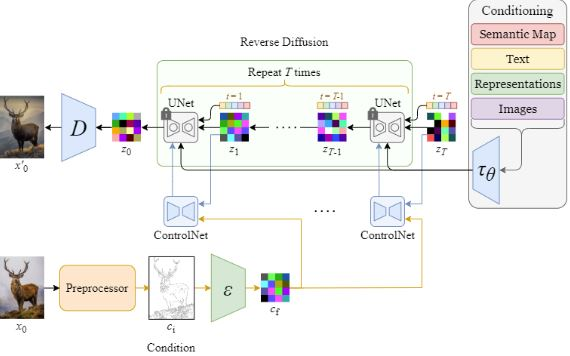

# StyleBlender: Blender Addon for Speed up StoryTelling

## Overview
In this project. I am aiming to utilize a diffusion model, in this case, one of the stable diffusion models from stability AI, to develop a tool for 3d artists. the tool is in the form of an add-on for the 3d software Blender3d. it will generate textures for the objects and scenes using a prompt from the artist and the rendering of the scene as a visual prompt.

## Problem Statement
This project aims to integrate the power of diffusion models into the 3d workflow of an animation project specifically for the previsualization parts. making it easier to develop the style of the project 

## Data Science Solution  
using generative AI, specifically diffusion models, the process of texturing objects in a 3d scene can be automated. The struggle so far in this space has been the integration of the tool into the working pipeline. and the lack of fine-tuning of the models available for this purpose.

## Features
Style Customization: Fine-tune diffusion models using reference images to align with your project's visual style.
Depth-Map Integration: Utilize Blender-generated depth maps to guide composition, ensuring stylistic and spatial consistency.
Simplified Workflow: Seamlessly integrates into Blender, making advanced diffusion model techniques accessible to 3D artists without requiring deep technical knowledge.
Rapid Previsualization: Accelerate the previsualization process, enabling artists to quickly explore and iterate on visual styles and narrative elements.

## Prerequisites
Blender version 4.5 or higher.
An active Hugging Face account with the necessary credentials.
Note: The addon is currently in development and not yet available for installation.

## first steps
To better understand the diffusion models, I made a diffusion model from Sctach with PyTorch. the model was built based on the research papers listed below:
1."Denoising Diffusion Probabilistic Models" (https://arxiv.org/abs/2006.11239v2)
2."Diffusion Models Beat GANs on Image Synthesis" (https://doi.org/10.48550/arXiv.2105.05233)

##The link for the model repository is here (this model was not used to generate the images in the tool being developed. it was helpful in understanding the architecture and how integrate it with into the software)

## Additional models
gaining a better understanding on how diffusion models work. In order to have control over the composition of the output to generate textures required for each object. an additional pre-processor needs to be used, ControlNets, are neural network architecture to add spatial conditioning controls to large, pre-trained text-to-image diffusion models. these models were initially introduced in this paper:
 "Adding Conditional Control to Text-to-Image Diffusion Models", https://arxiv.org/abs/2302.05543

and with the below Architecture they allow an added level of control over the outcome, in the case of this project the condition used is the depth data of the picture:

## Installation
Download the code az a zipfile and in blender -> prefrences -> add-ons -> StyleBlender
 
 
## featuring:

A section for uploading reference images to guide the style.
A field for entering descriptive text prompts.
A button to generate and utilize depth maps from the chosen camera perspective.
Designed primarily for landscape generation, MoodVista streamlines the creation of stylized environments, allowing artists to project generated textures onto 3D objects and animate scenes with enhanced visual fidelity.

## development 
A sample project will be added to showcase the capabilities of the addon 

## scripts
ui folder: containing the ui_panels.py file, it configures how the add-on looks in the blender software

sd_backend: containing two files that manage api calls to stability_api (hosts the diffusion model from stable diffusion) and automatic1111_api (used to do the pre-processing as it manages the control api )

__init__: the initial file that will run in order to register all the components and set up the models

config: configuring how add-on is set up for the first time of installation

handlers:

operators: Blender3D uses operators as a part of the api to handle different tasks this file hosts most of the functionality of the add-on with referenced for different methods 

Prefrences:

task_queue:

